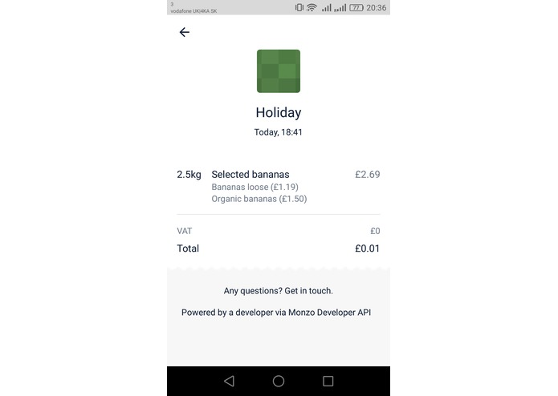

  

<h2 align="center">Receipt Reader</h2>

A Hack Cambridge 4D Project, parsing receipts to send on Monzo's API

## What it does
We've built a website that allows users to upload a photo of their receipts, and have the information update on their Monzo mobile app through the Monzo API.

Users log into their account on the website and upload a photo. Using image pre-processing and OCR, our program detects the relevant details on the receipt, such as items bought and the cost, as well as the merchant. Users can edit the details accordingly — for error correction or personal customisation — and then click submit. The information will then been sent to Monzo's API, and the data can then be seen on the user's Monzo account.

## How we built it
For Optical Character Recognition, we used Google Cloud Vision on Python. The website created using Python Flask and HTML. We've also used Monzo's API to allow information to connect to user accounts.

## Challenges we ran into
Since our team didn't have a Monzo account when we started and had some problems generating receipts on the account, we had some challenges testing out Monzo's API initially. However, Monzo's staff have kindly helped us with solving the issue.

## Contributers
- [Phyllis Poh](https://github.com/phypoh)
- [Jay Kanakiya](https://github.com/JayKanakiya)
- [Ondrej Bohdal](https://github.com/ondrejbohdal)

### Note
- This project was made at [Hack Cambridge 4D](https://www.hackcambridge.com/) under `24 hours with minimal pre-preparation`
